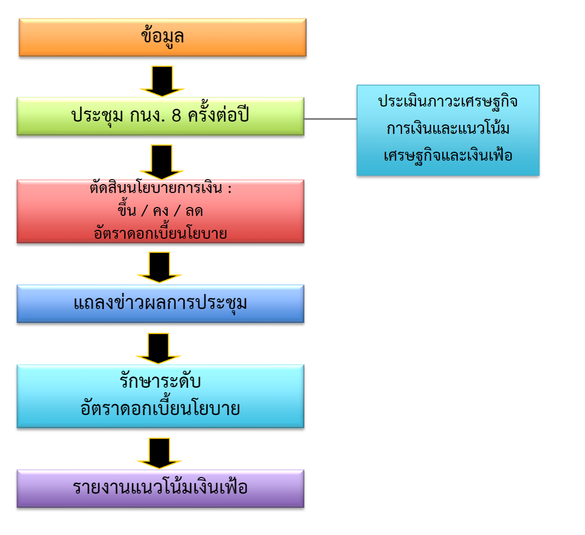

# การรักษาเสถียรภาพทางเศรษฐกิจ

## ความหมายและบทบาทของนโยบาย
- **การมีเสถียรภาพของราคาสินค้า:** รักษาราคาสินค้าและบริการไม่ให้ผันผวนมาก 
- **การจ้างงานเต็มที่:** ให้มีงานเพียงพอกับประชากรที่พร้อมทำงาน  
- **การเจริญเติบโตทางเศรษฐกิจ:** สนับสนุนการเพิ่มผลผลิตและคุณภาพชีวิต  
- **การกระจายรายได้ที่เป็นธรรม:** ลดความเหลื่อมล้ำในสังคม

---

## นโยบายการเงินของไทยในปัจจุบัน

### 1. ผูกค่าเงินบาทกับทองคำและเงิน
- **ช่วง:** หลังสงครามโลกครั้งที่ 2 - มิถุนายน 2540  
- **รายละเอียด:**  
  - เริ่มต้นด้วยการผูกกับทองคำ  
  - จากนั้นเปลี่ยนมาใช้ระบบผูกกับเงินสกุลอื่น โดยมี **ทุนรักษาระดับอัตราแลกเปลี่ยน (EEF)** เป็นผู้รักษาระดับอัตราแลกเปลี่ยนให้คงที่ 

### 2. การกำหนดเป้าหมายทางการเงิน (Monetary Targeting)
- **ช่วง:** กรกฎาคม 2540 – พฤษภาคม 2543  
- **บริบท:**  
  - หลังวิกฤติต้มยำกุ้งปี 40 ประเทศไทยเปลี่ยนระบบเป็นอัตราแลกเปลี่ยนลอยตัว (1Bath != 30USD ตลอดไป)

### 3. การกำหนดเป้าหมายเงินเฟ้อ (Inflation Targeting)
- **ตั้งแต่:** 23 พฤษภาคม 2543 – ปัจจุบัน  
- **แนวทาง:**  
  - เป็นแนวทางหลักในนโยบายการเงินปัจจุบัน มุ่งเน้นการควบคุมระดับเงินเฟ้อให้อยู่ในเป้าหมาย

### บทบาทของคณะกรรมการนโยบายการเงิน (กนง.)
- **กำหนดเป้าหมาย:** คำนึงถึงแนวทางแห่งรัฐและสภาพเศรษฐกิจ  
- **บริหารจัดการอัตราแลกเปลี่ยน:** ปฏิบัติตามกฎหมายว่าด้วยเงินตรา  
- **ติดตามและประเมิน:** ตรวจสอบการดำเนินมาตรการของธนาคารแห่งประเทศไทยผ่านการประชุม (ประมาณ 8 ครั้งต่อปี)

---

## นโยบายการคลัง

### ความหมาย  
- **นโยบายการคลัง:** การจัดการรายได้และรายจ่ายของรัฐบาลเพื่อควบคุมเศรษฐกิจ  
- **แบ่งเป็น:**  
  - **นโยบายการคลังแบบหดตัว:** ลดรายจ่ายหรือเพิ่มภาษีเพื่อชะลอเศรษฐกิจ  
  - **นโยบายการคลังแบบขยายตัว:** เพิ่มรายจ่ายหรือปรับลดภาษีเพื่อกระตุ้นเศรษฐกิจ

### เครื่องมือของนโยบายการคลัง

1. **รายจ่ายของรัฐบาล:**  
   - แบ่งตามลักษณะงาน เช่น การบริหารงานทั่วไป, เศรษฐกิจ, และการบริการชุมชนและสังคม  
   - แบ่งตามลักษณะเศรษฐกิจ เช่น ค่าตอบแทนแรงงาน, เงินอุดหนุน, ค่าใช้จ่ายประจำ
   - แบ่งตามโครงสร้างงบประมาณ เช่น การลงทุน, ชดใช้เงินคงคลัง, ค่าใช้จ่ายประจำ
   - แบ่งตามตามกระทรวงและหน่วยงาน

2. **รายรับของรัฐบาล:**  
   - **ภาษีอากร:** ทั้งภาษีทางตรงและทางอ้อม  
   - **รายได้จากการขายสินค้าและบริการ**  
   - **รายได้จากรัฐพาณิชย์**  
   - **แหล่งเงินกู้:** ทั้งภายในและภายนอกประเทศ  
   - **เงินคงคลัง:** เงินสะสมจากงบประมาณที่ผ่านมา

### ภาพรวมในประเทศไทย
- **ก่อนวิกฤติการณ์ (พ.ศ. 2530-2540):**  
  - การใช้จ่ายและรายรับออกแบบมาเพื่อรองรับการพัฒนาเศรษฐกิจ
- **ในช่วงวิกฤติ (2540):**  
  - ปรับเปลี่ยนนโยบายเพื่อลดผลกระทบจากวิกฤติการณ์เศรษฐกิจ
- **ยุคหลังวิกฤติ:**  
  - วางงบประมาณตามยุทธศาสตร์ชาติ (เช่น ปีงบประมาณ 2558) เน้นความเชื่อมั่น ความมั่นคง และการเจริญเติบโตอย่างยั่งยืน  
  - กระบวนการจัดทำงบประมาณมีส่วนร่วมจากหลายฝ่าย เช่น กระทรวงที่เกี่ยวข้อง คณะกรรมาธิการ และธนาคารแห่งประเทศไทย
