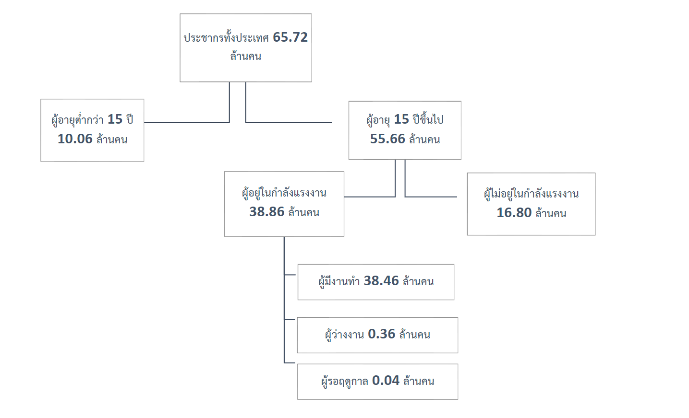
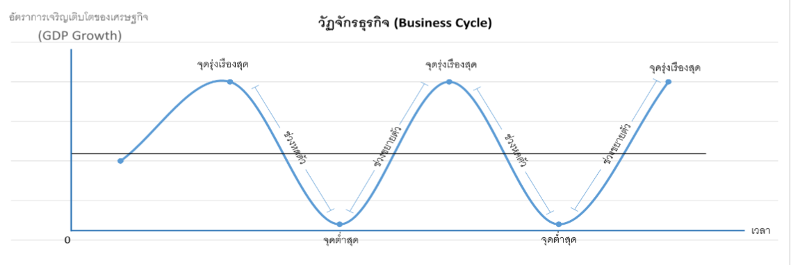
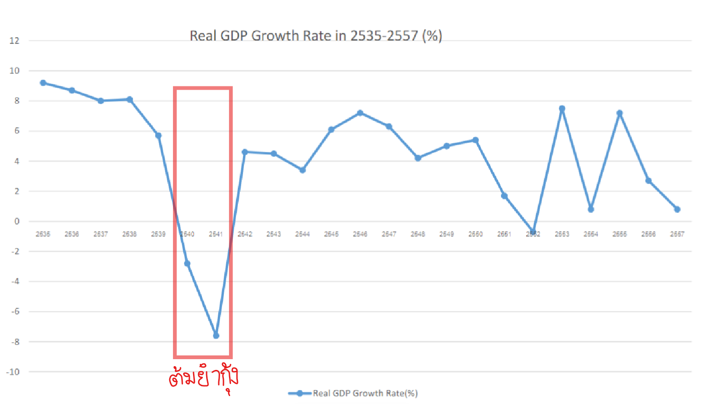

# ปัญหาทางเศรษฐกิจที่สำคัญ

## เงินเฟ้อ 💸

**คือ:**  
การที่ราคาสินค้าและบริการเพิ่มขึ้นเรื่อย ๆ ทำให้ค่าของเงินลดลง 📉  

**เช่น:**  
ปีนี้เลย์ราคา 20 บาท ปีหน้าขึ้นเป็น 22 บาท คือเงินเฟ้ออย่างอ่อน

**แบ่งประเภท:**  
- **เงินเฟ้ออย่างอ่อน (Mild inflation):** ราคาขึ้นเล็กน้อย  
- **เงินเฟ้อขั้นรุนแรง (Hyper inflation):** ราคาขึ้นเร็วและมาก  
- **ภาวะเงินฝืด (Deflation):** ราคาลดลงต่อเนื่อง

### เงินเฟ้อวัดได้จาก
ดัชนีราคาที่เปรียบเทียบราคาปัจจุบันกับปีฐาน (มักกำหนดเป็น 100) ซึ่งคำนวณได้จาก

$$
\text{CPI} = \frac{\sum_{i=1}^{n} P_{it} \, Q_{it}}{\sum_{i=1}^{n} P_{ib} \, Q_{ib}}
$$

โดยที่:  
- **$P_{it}$:** ราคาของสินค้าชนิดที่ *i* ณ เวลา *t*  
- **$Q_{it}$:** ปริมาณการบริโภคของสินค้าชนิดที่ *i* ณ เวลา *t*  
- **$P_{ib}$:** ราคาของสินค้าชนิดที่ *i* ณ ปีฐานที่ *b*  
- **$Q_{ib}$:** ปริมาณการบริโภคของสินค้าชนิดที่ *i* ณ ปีฐานที่ *b*

**ตัวอย่าง**

|ปี|ข้าวผัดกระเพรา (ต่อจาน)||ก๋วยเตี๋ยวต้มยำ (ต่อชาม)||
|:-:|:-:|:-:|:-:|:-:|
||**ราคา**|**ปริมาณ**|**ราคา**|**ปริมาณ**|
|2556|20 บาท|10|30 บาท|30|
|2557|25 บาท|30|40 บาท|50|
|2558|30 บาท|40|50 บาท|80|

$CPI_{2556} = \frac{(20 \times 10) + (30 \times 30)}{(20 \times 10) + (30 \times 30)} \times 100 = 100$

$CPI_{2557} = \frac{(25 \times 30) + (40 \times 50)}{(20 \times 10) + (30 \times 30)} \times 100 = 250$

$CPI_{2558} = \frac{(30 \times 40) + (50 \times 80)}{(20 \times 10) + (30 \times 30)} \times 100 = 472.72$

### สาเหตุ

- **อุปสงค์ฉุด (Demand-pull):** เมื่อผู้ซื้อมีความต้องการสูงเกินอุปทาน  
  *ตัวอย่าง:* ราคา GPU พุ่งเพราะคนซื้อมาขุด Bitcoin  
- **ต้นทุนผลัก (Cost-push):** ต้นทุนการผลิตสูงขึ้นส่งผลให้ราคาสินค้าเพิ่ม  
  *ตัวอย่าง:* ราคาน้ำมันแพงทำให้ค่าขนส่งเพิ่ม  
- **โครงสร้าง (Structural):** การเปลี่ยนแปลงในเศรษฐกิจทำให้ราคาเปลี่ยนไป  
- **กำไรส่วนเพิ่ม (Mark-up):** ผู้ผลิตบวกส่วนเพิ่มลงในราคาขาย

### ผลกระทบ

- ลดอำนาจซื้อ  
- ลดการลงทุน  
- กระจายรายได้ไม่เท่าเทียม  
- มีผลต่อการคลังของรัฐบาล  
- ส่งผลต่อการส่งออก-นำเข้าและสังคม

### แนวทางแก้ไข

- **นโยบายการเงิน:** ปรับอัตราดอกเบี้ยและปริมาณเงิน  
  *ตัวอย่าง:* รัฐบาลเพิ่มดอกเบี้ยเงินออมเพื่อให้คนใช้เงินน้อยลง (ของขายออกน้อยลงทำให้ราคาลดลง)  
- **นโยบายการคลัง:** ปรับรายจ่ายและภาษี  
  *ตัวอย่าง:* รัฐบาลเพิ่มภาษีความหวาน (ทำให้ Demand-pull ลดลง)  
- **ควบคุมราคา:** กำหนดเพดานราคาสินค้า  
  *ตัวอย่าง:* รัฐบาลกำหนดเพดานราคาน้ำมันไม่ให้เกิน 40 บาท/ลิตร

---

## การว่างงาน 💼

**คือ:**  
การว่างงานคือคนที่พร้อมทำงานแต่ยังไม่มีงานทำ

**แบ่งกลุ่มประชากร:**  
1. **ผู้มีงานทำ:** อายุ 15 ปีขึ้นไป, ทำงานตั้งแต่ 1 ชั่วโมงขึ้นไป, ได้รับค่าตอบแทน  
2. **ผู้ว่างงาน:** อายุ 15 ปีขึ้นไป, หางานแต่ยังไม่ได้งาน  
3. **ไม่อยู่ในกำลังแรงงาน:** เช่น นักเรียนหรือแม่บ้าน

**การคำนวณ:**

- **อัตราการว่างงาน:**

  $$
  \text{อัตราการว่างงาน} = \frac{\text{ผู้ว่างงาน}}{\text{แรงงานทั้งหมด}} \times 100
  $$

- **อัตราการมีส่วนร่วม:**

  $$
  \text{อัตราการมีส่วนร่วม} = \frac{\text{แรงงานทั้งหมด}}{\text{ประชากรผู้ใหญ่ทั้งหมด}} \times 100
  $$

### สาเหตุ

- **การว่างงานชั่วคราว:** ว่างงานระยะสั้นระหว่างการเปลี่ยนงาน  
- **การว่างงานจากวัฏจักรธุรกิจ:** เกิดในช่วงเศรษฐกิจถดถอย  
- **การว่างงานตามฤดูกาล:**  
  *ตัวอย่าง:* คนเก็บมะม่วงตกงานในช่วงหน้าหนาว (มะม่วงไม่ออกผล)  
- **การว่างงานตามโครงสร้าง:**  
  *ตัวอย่าง:* คนงานเย็บผ้าตกงานเพราะโรงงานเอาเครื่องจักรอัตโนมัติมาใช้แทน  
- **การว่างงานแอบแฝง:** การจ้างงานเกินความจำเป็น ทำให้โดน layoff เมื่อไม่เห็นผลตอบแทนเพิ่ม

### ผลกระทบ

- ลดการออมและการลงทุน  
- กระจายรายได้ไม่เท่าเทียม  
- ส่งผลต่อฐานะการคลังของรัฐบาลและสังคม

### แนวทางแก้ไข

- **นโยบายการเงิน:** ลดอัตราดอกเบี้ยและเพิ่มการปล่อยสินเชื่อ  
  *ตัวอย่าง:* รัฐบาลเพิ่มสินเชื่อ ทำให้คนสร้างธุรกิจของตนเองและเพิ่มการจ้างงาน  
- **นโยบายการคลัง:** เพิ่มงบประมาณจ้างงานและลดภาษีสำหรับธุรกิจ  
  *ตัวอย่าง:* รัฐบาลเพิ่มงบในโครงการสาธารณะ เช่น การปรับปรุงฟุตบาทเพื่อกระตุ้นการจ้างงาน

---

## วัฏจักรธุรกิจ 🔄

**คือ:**  
การเปลี่ยนแปลงของเศรษฐกิจในช่วงต่าง ๆ ที่เกิดขึ้นตามกาลเวลา ⏳

  

**แบ่งช่วง:**  
- **ช่วงขยายตัว (Expansion)** 📈  
- **ช่วงรุ่งเรืองสูงสุด (Peak)** 🌙  
- **ช่วงหดตัว (Contraction/Recession)** 📉  
- **ช่วงตกต่ำสุด (Revival)** 🪦

### สาเหตุ

- **ภายนอก:** เช่น สงคราม, นโยบายใหม่ของรัฐบาล  
- **ภายใน:** กลไกของตลาดที่ปรับตัวเอง

### ผลกระทบในแต่ละช่วง

- **ช่วงขยายตัว (Expansion):** เพิ่มการผลิตและจ้างงาน  
- **ช่วงรุ่งเรืองสูงสุด (Peak):** อาจเกิดภาวะอุปสงค์ส่วนเกินและเงินเฟ้อ  
- **ช่วงหดตัว (Contraction/Recession):** การผลิตและการจ้างงานลดลง  
- **ช่วงตกต่ำสุด (Revival):** อัตราการว่างงานสูงและเงินฝืด

### แนวทางแก้ไข

- **นโยบายการเงิน:**  
  *ตัวอย่าง:* รัฐบาลเพิ่มสินเชื่อ ทำให้ธุรกิจขยายกิจการและกระตุ้นการลงทุน  
- **นโยบายการคลัง:**  
  *ตัวอย่าง:* รัฐบาลลดภาษีประชาชน เพื่อให้มีเงินเหลือใช้ซื้อของมากขึ้น กระตุ้นการใช้จ่ายและเศรษฐกิจ
