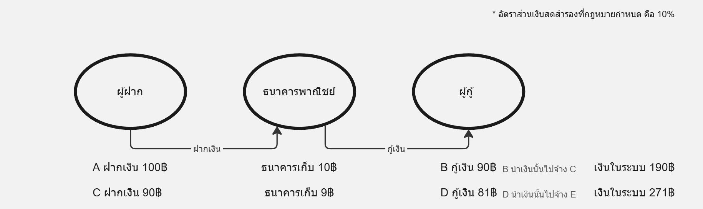

# การเงิน การธนาคารและการคลังในชีวิตประจำวัน

## การเงิน 💰

### เงินและวิวัฒนาการของเงิน 💰
**คือ:**  
สื่อกลางแลกเปลี่ยนที่สังคมยอมรับใช้ในการซื้อขายสินค้าและบริการ

**วิวัฒนาการ:**
- **แลกเปลี่ยนโดยตรง (Barter):** แลกเปลี่ยนสินค้ากันโดยตรง  
- **แลกเปลี่ยนทางอ้อม:** ใช้เงินเป็นสื่อกลางในการแลกเปลี่ยน

### ลักษณะและประเภทของเงิน 🔍
**ลักษณะของเงินที่ดี:** 
- เป็นของที่หายาก  
- ขนย้ายง่าย  
- แบ่งเป็นส่วนย่อยได้สะดวก  
- มีความทนทาน  
- มีมูลค่าคงตัว  
- มีลักษณะเหมือนกัน  
- ดูออกง่าย

**ประเภทของเงิน:**
- **แบ่งตามวัตถุดิบที่ใช้เป็นเงิน:**  
  - **เงินโภคภัณฑ์:** เงินที่มีมูลค่าในตัวเอง  
  - **เงินโลหะ:** เช่น เหรียญ  
  - **เงินกระดาษ:** เงินธนาคาร  
  - **เงินฝากกระแสรายวัน:** ใช้ชำระผ่านเช็ค  
- **แบ่งตามมูลค่า:**  
  - **เงินเต็มตัว (Full-bodied money):** มีมูลค่าในตัวเอง  
  - **เงินเครดิต (Credit money):** อิงกับความน่าเชื่อถือของผู้ใช้

### หน้าที่ของเงิน 📊
**หน้าที่หลักของเงิน:**  
- เป็น **สื่อกลางแลกเปลี่ยน** ❗  
- เป็น **เครื่องวัดมูลค่า** ❗  
- เป็น **มาตรฐานชำระหนี้**  
- เป็น **เครื่องสะสมทรัพย์สิน**

### ชนิดของเงิน, สิ่งใกล้เงิน และปริมาณเงินตรา

**ชนิดของเงิน:**  
- **ธนบัตร:** เงินกระดาษที่ออกโดยธนาคารกลาง  
- **เหรียญ:** เงินโลหะที่ใช้ในระบบเศรษฐกิจ  
- **เงินฝากกระแสรายวัน:** เงินในบัญชีที่สามารถถอนและชำระหนี้ได้ทันที  
  - *หมายเหตุ: เงินทั้ง 3 ชนิดนี้ถือเป็นเงินเครดิต*

**สิ่งใกล้เงิน:**  
- ทรัพย์สินที่สามารถแปลงเป็นเงินสดได้ง่าย เสียต้นทุนต่ำ และใช้เป็นเครื่องสะสมทรัพย์สินได้  
  - **บัญชีเงินฝากออมทรัพย์:** เปลี่ยนเป็นเงินสดได้โดยไม่สูญเสียมูลค่า  
  - **เงินฝากประจำ:** ในบางกรณี หากสามารถถอนออกได้ในเวลาที่ต้องการ  

**ปริมาณเงินตรา:**  
- จำนวนเงินทั้งหมดในระบบเศรษฐกิจ ณ ช่วงเวลาหนึ่ง  
  - รวมทั้งธนบัตร, เหรียญ, และเงินฝากที่ประชาชนและธุรกิจถืออยู่  

**ทฤษฎีปริมาณเงิน:**  
$$
MV = PT
$$  
โดยที่:  
- **M:** ปริมาณเงิน  
- **V:** ความเร็วในการหมุนเวียนของเงิน  
- **P:** ระดับราคาสินค้าและบริการ  
- **T:** ปริมาณการซื้อขาย

---

## ธนาคารและการสร้างเงิน 🏦

### ธนาคารกลาง
**คือ:**  
สถาบันที่มีบทบาทสำคัญในการออกธนบัตรและควบคุมการให้สินเชื่อ

**หน้าที่หลัก:**
- ออกธนบัตร  
- เป็นนายธนาคารของรัฐบาล  
- ควบคุมธนาคารพาณิชย์และควบคุมการให้สินเชื่อด้วยนโยบายการเงิน

### ธนาคารพาณิชย์
**คือ:**  
สถาบันการเงินที่ให้บริการรับฝากเงินและให้สินเชื่อกับประชาชน

**หน้าที่หลัก:**  
- รับฝากเงินกระแสรายวัน (ชำระผ่านเช็คได้) ❗  
- สร้างเงิน ❗

### การสร้างเงินของระบบธนาคาร
**คือ:**  
กระบวนการที่ธนาคารสร้างเงินผ่านการรับฝากและให้สินเชื่อ โดยไม่พิมพ์เงินสดโดยตรง แต่ขยายตัวของเงินในระบบเศรษฐกิจผ่านบัญชีเงินฝาก

**กระบวนการหลัก:**
- **เงินฝากขั้นต้น (Primary deposits):**  
  - เงินสดที่ประชาชนฝากเข้าธนาคาร  
- **เงินฝากขั้นสอง (Secondary deposits):**  
  - เมื่อธนาคารให้สินเชื่อ เงินที่ปล่อยออกไปจะถูกฝากคืนในระบบ ทำให้เกิดเงินฝากใหม่  
- **เงินฝากทั้งสิ้น (Total deposits):**  
  - ผลรวมของเงินฝากขั้นต้นและขั้นสอง ซึ่งสะท้อนการขยายตัวของเงินในระบบ

**สูตรคำนวณความสามารถในการสร้างเงินของธนาคารพาณิชย์:**
$$
\Delta D = \frac{\Delta C}{R}
$$

โดยที่:  
- **$\Delta D$:** จำนวนเงินฝากทั้งหมด (total)  
- **$\Delta C$:** เงินฝากที่ธนาคารได้รับมาครั้งแรก  
- **$R$:** อัตราส่วนเงินสดสำรองที่กฎหมายกำหนด

---

## นโยบายการเงินและการคลัง 📈

### นโยบายการเงิน
**คือ:**  
มาตรการที่ธนาคารกลางใช้เพื่อควบคุมปริมาณเงินและอัตราดอกเบี้ย

**ตัวอย่าง:**  
- ปรับอัตราดอกเบี้ย  
- ควบคุมสินเชื่อและปริมาณเงิน

### การคลัง
**คือ:**  
การบริหารจัดการรายรับและรายจ่ายของรัฐบาล

**การใช้จ่ายของรัฐบาล:**  
แบ่งตามลักษณะงาน, เศรษฐกิจ, ส่วนราชการ และโครงสร้างแผนงาน

**รายได้รัฐบาล:**  
1. **ภาษีอากร**
   - **อัตราภาษี:**  
     - **อัตราภาษีคงที่ (Proportional rate):** 10%   
       *ตัวอย่าง:* ภาษีมูลค่าเพิ่ม  
     - **อัตราภาษีถดถอย (Regressive rate):** 10% -> 8% -> 6%  
       *ตัวอย่าง:* ภาษีสรรพสามิตร (เหล้า, สินค้าและบริการฟุ่มเฟือย)  
     - **อัตราภาษีก้าวหน้า (Progressive rate):** 10% -> 20% -> 30%  
       *ตัวอย่าง:* ภาษีเงินได้บุคคลธรรมดา
   - **ภาษีทางตรง:** เช่น ภาษีเงินได้บุคคลธรรมดา/นิติบุคคล  
   - **ภาษีทางอ้อม:** เช่น ภาษีการขายสินค้าและบริการ  
   - **หลักเกณฑ์ที่นิยมใช้:**  
     1. หลักความสามารถ: ผู้ที่มีความสามารถมากควรเสียภาษีมากขึ้น  
     2. หลักประโยชน์: ผู้ที่ได้รับประโยชน์จากรัฐมาก ควรเสียภาษีบำรุงรัฐมากขึ้น  
2. **การขายสิ่งของและการบริการ**
3. **รัฐพาณิชย์**
4. **รายได้อื่นๆ**

---

## หนี้สาธารณะ 💼

### หนี้สาธารณะ
**คือ:**  
หนี้รัฐบาลที่กู้ยืมเพื่อใช้จ่ายและพัฒนาประเทศ

**แหล่งเงินกู้:**
- **ภายใน:** กู้จากเอกชน, สถาบันการเงิน, และธนาคารกลาง  
- **ภายนอก:** กู้จากเอกชน, สถาบันการเงิน, และรัฐ (ต่างประเทศ)
